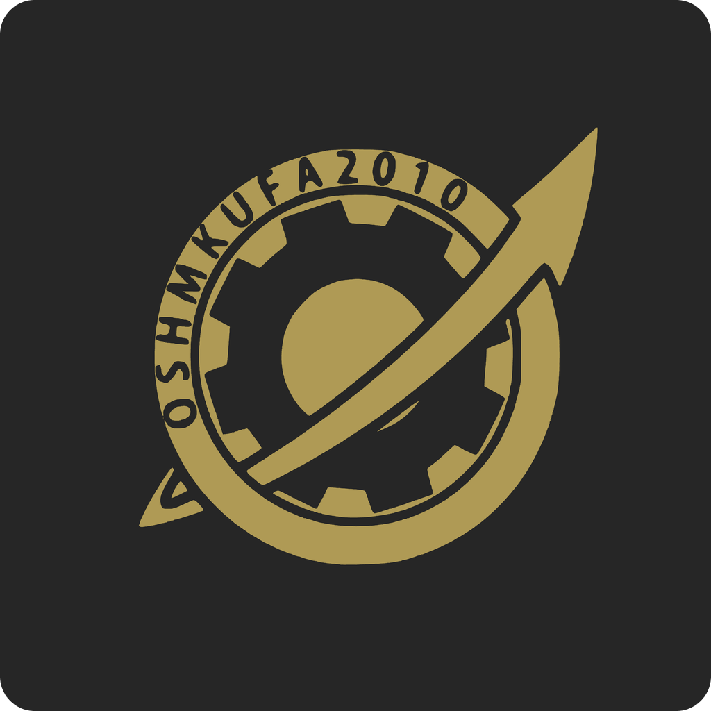

   
  

    
  

  

   
    
  

## ❔ About

PhoneWave is a Discord bot written in Python that tears through the fabric of time and space, to fullfil any wishes a mad scientist might have. 

You can find us in our [Laboratory](https://discord.gg/nAqaXhpafP).

## 📚 Features

WIP

## Inviting PhoneWave to your server

We do maintain an instance of PhoneWave, and can be invited over the link below.

> https://example.com/invite

## 🛰️ Setup, running the bot yourself

> There are multiples ways of running the bot.

WIP

## Contributing

Find more details in the [contributing guide](./CONTRIBUTING.md).

## Ways to help

- **Improve Documentation:** Adding missing information, fixing typos, etc.
- **Feedback:** Report bugs, request features, etc.
- **Contribute:** Propose new features, or find an existing one. 
